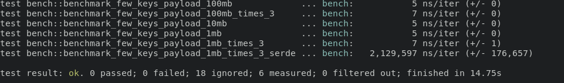

[](https://github.com/ShadowItaly/membuffer/actions)
[](https://crates.io/crates/membuffer)
[](https://codecov.io/gh/ShadowItaly/membuffer)
[](https://docs.rs/membuffer)

# membuffer
A rust library for rapid deserialization of huge datasets with few keys. The library is meant to be used with mmaped files, almost any crate on crates.io which does serialization and deserialization needs to process the whole structure. This makes it unusable with large memory mapped files. For this purpose this library only scans the header to get the schema of the datastructure and leaves all other fields untouched unless it is specifically asked to fetch them.

<span style='color: red'>
```diff
- Warning: This library uses memory transmutation and pointer arithmetic to improve performance and
prevent unnecessary parsing. Therefore the code is heavily tested. Do not exchange buffer created with this library between Little and
Big Endian Systems, it won't work!
```

**This data structure is optimized for deserialization, it does not parse the fields and therefore is extremely fast when deserializing big strings/Vectors**

**Use cases:**
- Handling structures with big fields as it is lazily parsed
- Saving huge datasets with few keys on disk
- For MMAPed Data structures as the fields does not get read until requested and therefore won't cause Page Faults

**Reasons not to use:**
- When reading all fields in the serialized data structure this crate will be only marginally faster than serde_json and is not as safe
- When using a big amount of keys and reading most of them, this library will bring almost no benefit in seralizing and deserializing


# Examples

```rust
use membuffer::{MemBufferWriter,MemBufferReader,MemBufferError};

fn main() {
  let mut writer = MemBufferWriter::new();
  //Add a vector with some numbers
  let some_bytes : Vec<u64> = vec![100,200,100,200,1,2,3,4,5,6,7,8,9,10];

  //Write the entry into the memory buffer, this is immutable after writing no changing after this
  writer.add_entry(&some_bytes[..]);
  
  //Create a Vec<u8> out of all the data
  let result = writer.finalize();

  //Read the data back in again
  let reader = MemBufferReader::new(&result).unwrap();

  //Tell the function the type to enable type checking will return err if the type is not right
  assert_eq!(reader.load_entry::<&[u64]>(0).unwrap(), vec![100,200,100,200,1,2,3,4,5,6,7,8,9,10]);
}
```

Example using serde in the data structure:
```rust
use membuffer::{MemBufferWriter,MemBufferReader,MemBufferError};
use serde::{Serialize,Deserialize};

#[derive(Serialize,Deserialize)]
struct HeavyStruct {
    vec: Vec<u64>,
    name: String,
    frequency: i32,
    id: i32,
}

fn main() {
  //Create a serde structure
  let value = HeavyStruct {
vec: vec![100,20,1],
     name: String::from("membuffer!"),
     frequency: 10,
     id: 200,
  };

  //Write the data into the memory buffer
  let mut writer = MemBufferWriter::new();
  writer.add_serde_entry(&value);

  //Create an Vec<u8> out of the data
  let result = writer.finalize();

  //Load the entry again
  let reader = MemBufferReader::new(&result).unwrap();

  //Specify the type for serde to do the type checking, internally the serde object is saved as JSON string representation
  let struc: HeavyStruct = reader.load_serde_entry(0).unwrap();

  assert_eq!(struc.vec, vec![100,20,1]);
  assert_eq!(struc.name,"membuffer!");
  assert_eq!(struc.frequency,10);
  assert_eq!(struc.id,200);
}
```

# Benchmark

Why is the library this fast? The benchmark consists of deserializing a data structure with different payload sizes either 1 MB, 10 MB or 100 MB. The membuffer load only the data structure layout and returns a slice to the strings instead of parsing the whole structure. This will help heaps if one uses MMAPed structures for example. As one can see in the benchmarks the speed of membuffer is only dependent on the number of keys and not of the size of the datastructure deserialized which is a good proof that the complexity of the deserialization does not depend on the size of the datastructure.

**Benchmark code:**
```rust
//Nighlty only feature! Run on the nightly version
#![feature(test)]
use test::Bencher;
use membuffer::{MemBufferWriter,MemBufferReader};
use serde::{Serialize,Deserialize};
use serde_json;


#[bench]
fn benchmark_few_keys_payload_1mb_times_3(b: &mut Bencher) {
  let mut huge_string = String::with_capacity(1_000_000);
  for _ in 0..1_000_000 {
    huge_string.push('a');
  }
  let mut writer = MemBufferWriter::new();
  writer.add_entry(&huge_string);
  writer.add_entry(&huge_string);
  writer.add_entry(&huge_string);
  let result = writer.finalize();
  assert!(result.len() > 3_000_000);

  b.iter(|| {
      let reader = MemBufferReader::new(&result).unwrap();
      let string1 = reader.load_entry::<&str>(0).unwrap();
      let string2 = reader.load_entry::<&str>(1).unwrap();
      let string3 = reader.load_entry::<&str>(2).unwrap();
      assert_eq!(string1.len(), 1_000_000);
      assert_eq!(string2.len(), 1_000_000);
      assert_eq!(string3.len(), 1_000_000);
      });   
}

#[derive(Serialize,Deserialize)]
struct BenchSerde<'a> {
one: &'a str,
       two: &'a str,
       three: &'a str
}

#[bench]
fn benchmark_few_keys_payload_1mb_times_3_serde(b: &mut Bencher) {
  let mut huge_string = String::with_capacity(1_000_000);
  for _ in 0..1_000_000 {
    huge_string.push('a');
  }
  let first = BenchSerde {
one: &huge_string,
       two: &huge_string,
       three: &huge_string
  };

  let string = serde_json::to_string(&first).unwrap();

  b.iter(|| {
      let reader: BenchSerde = serde_json::from_str(&string).unwrap();
      assert_eq!(reader.one.len(), 1_000_000);
      assert_eq!(reader.two.len(), 1_000_000);
      assert_eq!(reader.three.len(), 1_000_000);
      });
}
```
